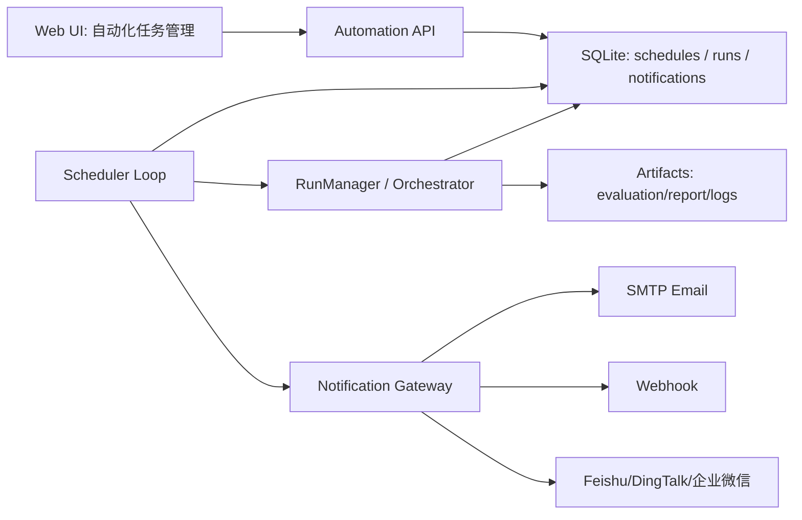

# UTBench 定时评测与推送服务设计方案

## 目标

为 UTBench 增加一套可在 Web 端管理的自动化能力，让用户可以配置周期性评测任务，并在任务完成、失败、超时或质量异常时，通过邮件、Webhook 等消息通道收到通知。

这套能力要解决三个问题：

- 定时触发：按 cron 或固定间隔自动创建评测任务。
- 状态追踪：记录每次触发、运行、报告生成、通知发送的完整状态。
- 结果推送：把评测摘要、失败原因、报告链接和关键指标发送到指定渠道。

## 推荐方案

推荐采用“SQLite 持久化调度中心 + Web 管理页 + 通知网关”的方案。

不建议只依赖系统 cron 或 Windows 任务计划程序，因为当前项目已经有 Web UI、SQLite、运行记录、报告资产和模型/Agent 配置。把自动化任务作为一等资源纳入 UTBench 管理，后续更容易支持暂停、手动触发、失败补发、历史审计和团队协作。



## 核心对象

### Automation Schedule

表示一个可重复触发的评测计划。

关键字段：

- `id`: 计划 ID。
- `name`: 用户可读名称，例如 `nightly-agent-regression`。
- `enabled`: 是否启用。
- `trigger_type`: `cron` 或 `interval`。
- `cron_expr`: cron 表达式，例如 `0 2 * * *`。
- `timezone`: 时区，默认 `Asia/Shanghai`。
- `run_spec_json`: 评测任务模板，复用现有 RunSpec。
- `notify_policy_json`: 通知策略。
- `next_fire_at`: 下次触发时间。
- `last_fire_at`: 上次触发时间。
- `created_at_utc` / `updated_at_utc`。

### Automation Run

表示某个计划的一次实际触发。

关键字段：

- `id`: 自动化运行 ID。
- `schedule_id`: 所属计划。
- `run_id`: 真实评测任务 ID。
- `trigger_reason`: `schedule`、`manual`、`retry`。
- `status`: `queued`、`running`、`completed`、`failed`、`canceled`、`notify_failed`。
- `started_at_utc` / `completed_at_utc`。
- `summary_json`: 评测摘要快照。
- `report_path`: HTML 报告路径。
- `error_message`: 调度或启动错误。

### Notification Channel

表示一个推送通道。

第一阶段建议支持：

- `email_smtp`
- `webhook`

第二阶段再扩展：

- `feishu`
- `dingtalk`
- `wechat_work`
- `slack`

通道配置中敏感字段不直接保存明文，优先保存环境变量名。

例如：

```json
{
  "type": "email_smtp",
  "host": "smtp.example.com",
  "port": 587,
  "username_env": "UTBENCH_SMTP_USER",
  "password_env": "UTBENCH_SMTP_PASSWORD",
  "from": "utbench@example.com",
  "to": ["team@example.com"]
}
```

## 数据库表设计

```sql
CREATE TABLE automation_schedules (
  id TEXT PRIMARY KEY,
  name TEXT NOT NULL,
  enabled INTEGER NOT NULL DEFAULT 1,
  trigger_type TEXT NOT NULL,
  cron_expr TEXT,
  interval_seconds INTEGER,
  timezone TEXT NOT NULL DEFAULT 'Asia/Shanghai',
  run_spec_json TEXT NOT NULL,
  notify_policy_json TEXT NOT NULL,
  next_fire_at_utc TEXT,
  last_fire_at_utc TEXT,
  created_at_utc TEXT NOT NULL,
  updated_at_utc TEXT NOT NULL
);

CREATE TABLE automation_runs (
  id TEXT PRIMARY KEY,
  schedule_id TEXT NOT NULL,
  run_id TEXT,
  trigger_reason TEXT NOT NULL,
  status TEXT NOT NULL,
  started_at_utc TEXT,
  completed_at_utc TEXT,
  summary_json TEXT,
  report_path TEXT,
  error_message TEXT,
  created_at_utc TEXT NOT NULL,
  FOREIGN KEY(schedule_id) REFERENCES automation_schedules(id)
);

CREATE TABLE notification_channels (
  id TEXT PRIMARY KEY,
  name TEXT NOT NULL,
  type TEXT NOT NULL,
  enabled INTEGER NOT NULL DEFAULT 1,
  config_json TEXT NOT NULL,
  created_at_utc TEXT NOT NULL,
  updated_at_utc TEXT NOT NULL
);

CREATE TABLE notification_deliveries (
  id TEXT PRIMARY KEY,
  automation_run_id TEXT NOT NULL,
  channel_id TEXT NOT NULL,
  status TEXT NOT NULL,
  attempt INTEGER NOT NULL DEFAULT 1,
  subject TEXT,
  payload_json TEXT,
  response_excerpt TEXT,
  error_message TEXT,
  sent_at_utc TEXT,
  created_at_utc TEXT NOT NULL,
  FOREIGN KEY(automation_run_id) REFERENCES automation_runs(id),
  FOREIGN KEY(channel_id) REFERENCES notification_channels(id)
);
```

建议索引：

```sql
CREATE INDEX idx_automation_schedules_enabled_next
  ON automation_schedules(enabled, next_fire_at_utc);

CREATE INDEX idx_automation_runs_schedule_created
  ON automation_runs(schedule_id, created_at_utc DESC);

CREATE INDEX idx_notification_deliveries_run
  ON notification_deliveries(automation_run_id);
```

## 调度流程

调度器随 Web Server 启动，内部使用一个后台 goroutine。

每 10 到 30 秒扫描一次：

1. 查询 `enabled = 1` 且 `next_fire_at_utc <= now` 的 schedule。
2. 使用数据库事务抢占任务，避免重复触发。
3. 生成 `automation_run` 记录，状态为 `queued`。
4. 根据 `run_spec_json` 调用现有 RunManager 创建真实评测任务。
5. 更新 `automation_run.run_id` 和状态。
6. 计算下一次 `next_fire_at_utc`。
7. 后台监听评测任务完成事件。
8. 读取 `evaluation_result.json`、`report_summary.json`、`report.html`。
9. 生成通知 payload，并投递到配置的渠道。
10. 写入 `notification_deliveries`。

重复触发保护：

- 同一个 schedule 默认不允许并发运行。
- 如果上一次仍在 running，下一次触发标记为 `skipped_running` 或延后。
- 可以增加配置 `concurrency_policy`: `skip`、`queue`、`replace`，第一阶段默认 `skip`。

## 通知策略

每个 schedule 可配置通知条件。

```json
{
  "channels": ["email-default", "webhook-ci"],
  "on_success": true,
  "on_failure": true,
  "on_canceled": true,
  "on_score_drop": true,
  "score_drop_threshold": 0.05,
  "include_report_link": true,
  "include_top_failures": 10
}
```

第一阶段建议支持：

- 成功通知。
- 失败通知。
- 启动失败通知。
- 通知失败记录，但不阻塞评测任务。

第二阶段支持：

- 综合分下降阈值。
- 指定模型排名下降。
- 失败样本数量超过阈值。
- mutation 分数低于阈值。

## 通知内容

邮件标题示例：

```text
[UTBench] nightly-agent-regression completed: score 88.4, failed 6/160
```

正文建议包含：

- 自动化任务名称。
- 本次 run_id。
- 触发时间、开始时间、完成时间、耗时。
- 运行模式：Docker / native。
- Subject / Model / Agent / Skill。
- 语言、场景、样本数量。
- 编译通过率、测试通过率、覆盖率、变异分数、综合分。
- 失败样本 Top N。
- 计分剔除数量和原因摘要。
- report.html 路径或 Web 链接。
- report_summary.json 路径。

Webhook payload 示例：

```json
{
  "event": "utbench.automation.completed",
  "schedule_id": "nightly-agent-regression",
  "run_id": "20260506T020000Z",
  "status": "completed",
  "summary": {
    "total": 160,
    "failed": 6,
    "score": 88.4,
    "compile_pass_rate": 0.98,
    "test_pass_rate": 0.94,
    "mutation_score": 0.76
  },
  "report_html": "artifacts/runs/20260506T020000Z/report/report.html"
}
```

## Web UI 设计

建议新增一级页面或放在“任务列表”下的 Tab：`自动化`。

页面区域：

- 自动化计划列表：名称、状态、下次运行、上次结果、通知渠道。
- 新建/编辑计划弹窗：复用新建任务的模型、语言、样本、Agent/Skill 选择器。
- 通知渠道管理：新增 SMTP、Webhook，支持测试发送。
- 运行历史：查看每次自动触发的 run_id、结果、通知状态。
- 手动触发：立即运行一次当前计划。

关键交互：

- 保存计划后立即计算下一次触发时间。
- 关闭计划不会删除历史。
- 删除计划前提示是否保留历史。
- 通知渠道测试不依赖评测任务。

## API 设计

```text
GET    /api/automations
POST   /api/automations
GET    /api/automations/{id}
PUT    /api/automations/{id}
DELETE /api/automations/{id}
POST   /api/automations/{id}/trigger
GET    /api/automations/{id}/runs

GET    /api/notification-channels
POST   /api/notification-channels
GET    /api/notification-channels/{id}
PUT    /api/notification-channels/{id}
DELETE /api/notification-channels/{id}
POST   /api/notification-channels/{id}/test
```

## 配置文件兜底

虽然推荐放 SQLite，但可以保留一个 YAML bootstrap 配置，用于首次启动。

```yaml
automation:
  enabled: true
  scheduler_interval_seconds: 15
  default_timezone: Asia/Shanghai

notifications:
  smtp:
    default_from: utbench@example.com
```

实际 schedule 和 channel 仍以 SQLite 为准。

## 安全与运维

- SMTP 密码、Webhook token 不写入报告和运行日志。
- 敏感字段优先使用环境变量引用。
- 通知 payload 做脱敏，过滤 `api_key`、`authorization`、`cookie` 等字段。
- 命令行、Docker 参数和环境变量进入日志前要脱敏。
- 调度器启动时检查上次遗留的 `running` automation_run，标记为 `interrupted` 或恢复监听。
- 所有通知投递都有 `notification_deliveries` 审计记录。

## 实施阶段

### P0: 最小可用

- SQLite 表：schedule、automation_run、notification_channel、notification_delivery。
- 内置 scheduler loop。
- 支持 cron。
- 支持 SMTP 邮件。
- 支持 Webhook。
- Web UI 支持新建、暂停、立即触发、查看历史。

### P1: 质量告警

- 综合分下降告警。
- 模型排名下降告警。
- 失败样本 Top N。
- 通知失败重试。
- 通知模板预览。

### P2: 团队集成

- 飞书、钉钉、企业微信。
- 多收件人组。
- 周报/月报聚合。
- 对比上一轮、上一周、指定 baseline。

## 推荐落地顺序

1. 先实现 SQLite schema 和 API。
2. 再实现后台 scheduler loop。
3. 接入现有 RunManager 创建任务。
4. 先支持 Webhook，因为调试成本最低。
5. 再支持 SMTP 邮件。
6. 最后补 Web UI 管理页和通知历史。

这样可以保证核心链路先跑通，再逐步把体验做完整。
