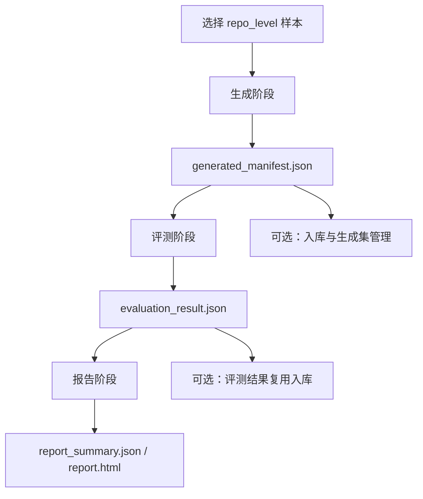

# 项目级评测链路说明

本文说明当前 UT-Bench 对项目级样本的完整评测链路。这里的“项目级”对应数据集里的 `repo_level`，运行时会被映射为统一的 `project_level` 策略。

## 核心概念

| 名称 | 含义 |
| --- | --- |
| `repo_level` | 数据集类别，表示样本来自一个真实或近真实项目，需要项目上下文、依赖和构建文件。 |
| `project_level` | 运行策略，表示生成和评测都按项目工作区执行，而不是只评测单个源码文件。 |
| `FileModule` | 跨生成、评测、报告共用的文件模块契约，记录 `workspace_root`、`target_file`、`package_dir`、`module_import`、`generated_test_file` 等信息。 |
| `GeneratedManifest` | 生成阶段产物，记录模型或 Agent 生成的测试代码路径、token、trace、复用信息和项目级策略字段。 |
| 生成集 | 从某一轮生成结果中沉淀出来的模型生成样本集合，可备注、筛选、复用评测。 |

当前链路的核心目标是：数据集仍按 `repo_level` 管理，但生成、评测、复用、报告都用显式策略字段表达项目级语义，避免只靠路径猜测。

## 总体流程



完整流水线由 `internal/orchestrator/service.go` 编排，阶段是：

1. `dataset`：校验参数并发现样本。
2. `generate`：按模型或 Agent 生成测试。
3. `evaluate`：编译、运行测试、覆盖率、变异测试。
4. `report`：聚合指标并生成 HTML/JSON 报告。
5. `ingest`：可选，把 run 产物写入 SQLite，支持后续复用。

## 入口命令

常用完整运行：

```powershell
.\utbench.exe run `
  --models deepseek `
  --langs java `
  --class repo_level `
  --project gson `
  --max-samples 4 `
  --mutation-enabled `
  --reuse-generated `
  --ingest `
  --db-path .\storage\utbench.db `
  --config .\configs\models.yaml
```

分阶段运行：

```powershell
.\utbench.exe generate --models deepseek --langs java --class repo_level --project gson --max-samples 4 --reuse-generated
.\utbench.exe evaluate --manifest .\artifacts\runs\<run-id>\generated\generated_manifest.json --mutation-enabled
.\utbench.exe report --evaluation .\artifacts\runs\<run-id>\evaluation\evaluation_result.json
```

环境自检：

```powershell
.\utbench.exe doctor --langs python,go,java,cpp --mutation-enabled
.\utbench.exe dataset validate --dataset-root .\datasets --langs python,go,java,cpp --class repo_level --strict
```

## 1. 数据集发现

项目级样本位于类似路径：

```text
datasets/<lang>/<lang>_code_files_repo_level/<group>/<project>/...
```

发现流程：

1. `orchestrator.Run` 调用 `dataset.ValidateSpec(spec)` 校验语言、类别、路径等参数。
2. `dataset.DiscoverSamples(spec)` 根据 `--langs`、`--class repo_level`、`--project`、`--scenario`、`--max-samples` 等过滤样本。
3. 样本以 `contracts.SampleRef` 传给生成阶段，包含 `ID`、`Language`、`Category`、`Scenario`、`Path`、`SourceMD5`。

项目级样本需要能解析出仓库级元数据。当前支持：

- `entry.*` 搭配同目录 `meta.json`。
- 普通源码文件搭配同目录 `<name>.meta.json`。
- 对部分规范路径调用 `dataset.SynthesizeRepoLevelMeta` 自动推断。

关键元数据：

```json
{
  "sample_id": "gson_src_main_java_com_google_gson_gson",
  "workspace_root": "../../workspace",
  "target_file": "src/main/java/com/google/gson/Gson.java",
  "module_import": "com.google.gson.Gson",
  "package_name": "com.google.gson",
  "requirements": []
}
```

如果 `workspace_root`、`target_file` 缺失，或工作区不存在，评测阶段会把失败归为数据集问题。

## 2. 生成策略

生成阶段在 `internal/runner/service.go`，项目级策略在 `internal/runner/generation_strategy.go`。

策略解析规则：

1. 默认由 `DatasetModeForClass(sample.Category)` 映射：
   - `self_contained` -> `single_file`
   - `repo_level` -> `project_level`
2. 如果样本能加载 repo-level 元数据，也会提升为 `project_level`。
3. `project_level` 会设置：
   - `DatasetMode = project_level`
   - `GenerationStrategy = project_level`
   - `EvaluationStrategy = project_level`
   - `PromptMode = repo_level`

这些字段会写入 `GeneratedCase`，后续评测和报告不需要重新猜测样本类型。

## 3. Prompt 与生成执行

项目级样本使用 `buildRepoLevelPrompt`。Prompt 会告诉模型：

- 当前是 `repo_level` 模式。
- 目标是为项目工作区补充单元测试，优先覆盖入口目标文件。
- 需要关注 mutation testing，避免弱断言。
- 不允许安装依赖、改运行环境、访问真实网络或凭据。
- 输出裸代码，不要 markdown 和解释。

生成执行有两条路径：

| 路径 | 说明 |
| --- | --- |
| Model API | 直接调用模型接口，返回一个生成测试文件。 |
| CLI Agent | 准备独立工作区、注入 skill、执行沙箱 preflight、运行 Agent、收集 trace、workspace diff、stdout/stderr，再回收生成测试文件。 |

CLI Agent 的项目级流程会：

1. 复制项目工作区到 run 下的 `agent_workspaces`。
2. 注入 skill 到 `.utbench/skills` 或 Agent 原生 skill 目录。
3. 执行语言和框架 preflight，例如 `python3 -m pytest --version`。
4. 执行 Agent 命令。
5. 对执行前后工作区做快照，生成 diff。
6. 回收生成的测试文件，并写入 `generated/tests/...`。
7. 生成 trace、trajectory、raw stdout/stderr 等诊断产物。

如果 Agent 命令非零退出，但已经写出了可用测试文件，当前链路会优先回收该测试文件，保留执行错误作为 warning；只有没有测试文件时才把生成判为失败。

## 4. 生成复用与生成集

生成复用由 `--reuse-generated` 和 SQLite 共同控制：

1. 运行前构造 `generation_key`，包含被测对象、样本、源码、Prompt、环境等身份信息。
2. 如果数据库中存在同 key 的成功生成结果，就复制历史测试文件到本轮 `generated/tests/...`。
3. 当前 `GeneratedCase` 标记：
   - `reused = true`
   - `reuse_stage = generation`
   - `reuse_key = <generation_key>`
   - `reused_from_run_id`
   - `reused_from_case_id`

生成集是对模型生成样本的管理层：

- 从已完成 run 的 manifest 晋升而来。
- 只接受成功且存在测试文件的 case。
- 会把生成测试复制到 `generated_sets/<set-id>/tests/...`。
- 支持名称、备注、状态、样本备注。
- 可以直接用生成集 manifest 启动评测，实现“复用生成，只重新评测”。

注意：生成集管理的是“模型生成的评测样本”，不是原始数据集样本。

## 5. 评测策略

评测阶段在 `internal/evaluator/service.go`。输入是 `generated_manifest.json`。

评测前会做：

1. 读取 manifest。
2. 归一化 Windows/Linux 路径分隔符。
3. 捕获评测环境指纹。
4. 如果开启 `--reuse-evaluation`，用 `evaluation_key` 查询 SQLite。
5. 对每个 `GeneratedCase` 调用 `evaluateOne`。

评测策略解析在 `internal/evaluator/evaluation_strategy.go`：

1. 优先读取 `GeneratedCase.DatasetMode`。
2. 老产物没有该字段时，按以下顺序兼容推断：
   - `EvaluationStrategy == project_level`
   - `PromptMode == repo_level`
   - `SamplePath` 包含 `repo_level`
   - 否则按 `single_file`

评测结果 `EvaluationResult` 会再次写入：

- `dataset_mode`
- `generation_strategy`
- `evaluation_strategy`
- `file_module`

这样报告和数据库可以直接展示项目级上下文。

## 6. 项目级评测执行步骤

所有语言通过 `LanguageEvaluator` 接口统一执行：

1. `PrepareWorkspace`
2. `CompileCheck`
3. `ExecuteTests`
4. `ParseTestCounts`
5. `EstimateAssertionDensity`
6. `CollectCoverage`
7. `CollectMutation`

项目级样本的 `PrepareWorkspace` 会使用 repo-level 元数据复制或准备完整项目工作区，并把生成测试放到项目能识别的位置。工作区上下文通过 `WorkspaceContext` 返回，项目级分支会设置：

```text
Extra["isRepoLevel"] = "true"
Extra["packageDir"] / Extra["targetFile"] / Extra["moduleDir"] 等语言相关字段
```

语言侧当前大致行为：

| 语言 | 项目级准备与执行 |
| --- | --- |
| Python | 复制项目工作区到临时目录，过滤缓存/虚拟环境，把生成测试放入 pytest 可发现位置，执行 `python -m pytest <test>`。 |
| Go | 复制项目工作区，定位 `package_dir`，编译用 `go test -c`，测试用 `go test -v <pkg>`，覆盖率和变异测试按目标包/目标文件收集。 |
| Java | 复制 Maven 项目，定位模块目录和测试类，编译用 `mvn ... test-compile`，测试用 Surefire 指定测试类，覆盖率用 JaCoCo，变异测试用 PIT。 |
| C++ | 复制项目工作区，按元数据构造测试/harness/CMake 入口，使用 GoogleTest 编译运行，覆盖率和变异测试按 C++ evaluator 实现收集。 |

如果编译失败，后续测试、覆盖率、变异测试不会继续。  
如果样本测试没有通过，变异测试会跳过并记录 `baseline tests failed, skipping mutation`。

## 7. 指标产出

每个样本最终写入 `EvaluationResult`，核心字段包括：

- 编译：`compile_pass`、`compile_error`
- 测试：`test_pass`、`test_pass_count`、`test_total_count`、`test_pass_rate`、`test_error`
- 覆盖率：`line_coverage`、`branch_coverage`、`coverage_error`
- 变异：`mutation_score`、`mutation_total`、`mutation_killed`、`mutation_survived`、`mutation_error`、`mutation_tool`
- 断言：`assertion_count`、`test_case_count`、`assertion_density`
- 成本：`prompt_tokens`、`completion_tokens`、`total_tokens`、`token_source`、`estimated_cost_usd`
- 诊断：`trace_path`、`trajectory_path`、`workspace_diff_path`
- 归因：`failure_origin`、`score_eligible`、`score_exclusion_reason`

失败归因大致规则：

| 归因 | 典型情况 |
| --- | --- |
| `dataset` | 源文件缺失、repo-level 元数据缺失、workspace 不存在。 |
| `environment` | 工具缺失、依赖解析失败、沙箱 preflight 失败、权限问题。 |
| `tool` | 覆盖率/变异工具自身错误，或明确未实现的项目级能力。 |
| `model` | 生成测试编译不过、测试失败、测试通过率不足。 |
| `none` | 没有失败。 |

## 8. 报告与入库

报告阶段读取 `evaluation_result.json`，生成：

```text
artifacts/runs/<run-id>/report/report_summary.json
artifacts/runs/<run-id>/report/report.html
```

报告会按模型、语言、场景等维度聚合：

- 编译通过率
- 样本测试通过率
- 用例级通过率
- 行覆盖率
- 变异分数
- 断言密度
- token 统计
- 失败类型和排除原因

入库由 `store` 模块完成。常见入口：

```powershell
.\utbench.exe db ingest-run --run-id <run-id> --output-root .\artifacts --db-path .\storage\utbench.db
```

入库后可支持：

- 历史生成复用。
- 历史评测复用。
- Web UI 查看 run、报告、生成集。
- 生成集晋升与备注管理。

## 9. 关键产物路径

| 产物 | 路径 |
| --- | --- |
| 生成清单 | `artifacts/runs/<run-id>/generated/generated_manifest.json` |
| 生成测试 | `artifacts/runs/<run-id>/generated/tests/<subject>/<lang>/<sample>.test.<ext>` |
| Prompt 快照 | `artifacts/runs/<run-id>/generated/prompts/...` |
| 生成元数据 | `artifacts/runs/<run-id>/generated/metadata/...` |
| Agent 工作区 | `artifacts/runs/<run-id>/agent_workspaces/...` |
| Agent trace | `artifacts/runs/<run-id>/generated/metadata/agent_traces/...` |
| 评测结果 | `artifacts/runs/<run-id>/evaluation/evaluation_result.json` |
| 报告 | `artifacts/runs/<run-id>/report/report.html` |
| 生成集 | `artifacts/generated_sets/<generated-set-id>/...` |

## 10. 当前注意事项

1. 项目级样本必须能解析出 repo-level 元数据；否则会在评测准备阶段失败。
2. Docker 运行时要确保 host/container 路径映射一致，尤其是 Windows 生成的 manifest 被 Linux 容器评测时。
3. 生成复用依赖 SQLite 和成功入库；只打开 `--reuse-generated` 但没有 `--db-path` 或历史记录时不会命中。
4. 评测复用默认关闭，需要显式 `--reuse-evaluation`，且环境指纹、评测 key 必须匹配。
5. 变异分数不是一定存在：编译失败、测试失败、工具失败、超时或 mutation policy 跳过时，可能只有 `mutation_error`。
6. Agent 沙箱镜像和主评测镜像职责不同：
   - `utbench-agent-base:latest` 用于 CLI Agent 生成前的轻量编译/冒烟检查。
   - `utbench:latest` 用于完整评测工具链。
7. 老的 manifest 可能缺少 `dataset_mode` 等策略字段，评测阶段会兼容推断，但新产物应始终写入这些字段。

## 11. 代码定位

| 模块 | 主要文件 |
| --- | --- |
| 编排 | `internal/orchestrator/service.go` |
| 样本发现与文件模块 | `internal/dataset/`、`internal/dataset/file_module.go` |
| 生成策略 | `internal/runner/generation_strategy.go` |
| Prompt | `internal/runner/prompt.go` |
| 生成执行 | `internal/runner/service.go`、`internal/runner/adapter_cli.go`、`internal/runner/adapter_model.go` |
| 评测策略 | `internal/evaluator/evaluation_strategy.go` |
| 语言评测接口 | `internal/evaluator/lang_eval.go` |
| 各语言项目级评测 | `internal/evaluator/*_repo_level.go`、`internal/evaluator/*_eval_impl.go` |
| 报告 | `internal/reporter/service.go` |
| 入库与复用 | `internal/store/` |
| Web 生成集 | `internal/web/server.go`、`internal/web/static/partials/generated-sets.html` |
